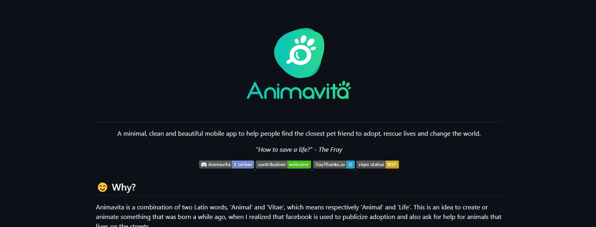

# Projeto com README
Um projeto de teste com um arquivo README👏

 

## Tecnologias utilizadas
- HTML
- CSS
- JS

## Como ultilizar 

1 - Clone pro projeto
```
git clone <url>
```
2 - Acesse a pasta do projeto
```
cd repositorio-com-readme